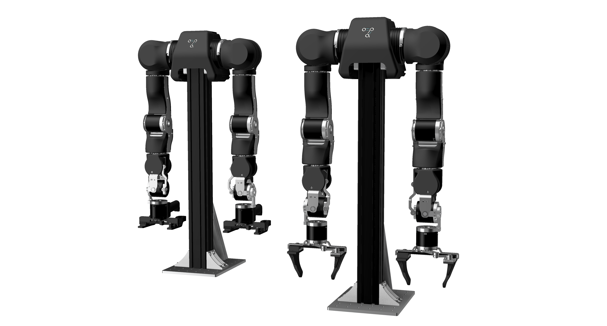
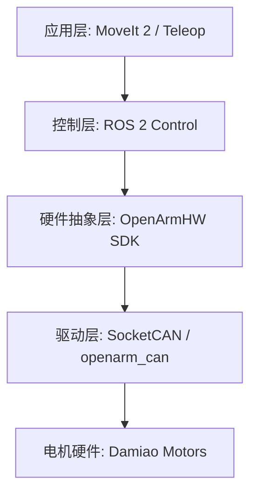

# OpenArm: 开源 7 自由度柔顺人机协作机械臂

OpenArm 是一个高性能、低成本且完全开源的 7 自由度人机协作机械臂，专为 **物理 AI 研究**、**接触密集型任务** 以及 **柔顺控制算法体系** 而设计。



## 🚀 核心特性

- **极致柔顺性**：底层基于大秒（Damiao）电机的 MIT 控制协议，可实现关节维度的刚度与阻尼精确控制。
- **高动态响应**：SocketCAN 驱动架构，闭环控制周期可达 500μs。
- **物理 AI 基因**：高反向驱动（Backdrivability），支持无力传感器条件下的碰撞检测与力反馈遥操作。
- **全生态兼容**：无缝集成 ROS 2 Humble/Jazzy，提供 MoveIt 2 配置与物理仿真接口。

---

## 📂 模块指南

| 模块名称 | 路径 | 功能说明 |
| :--- | :--- | :--- |
| **OpenArm CAN** | `src/openarm_can` | **底层通讯驱动**。C++ 实现的 SocketCAN 协议库，包含 Python 绑定。 |
| **OpenArm ROS2** | `src/openarm_ros2` | **系统集成层**。提供 `ros2_control` 硬件接口、带手爪控制的 Bringup 脚本。 |
| **Description** | `src/openarm_description` | **机器人描述**。URDF 模型、Xacro 宏以及高精度 Mesh 文件。 |
| **Hardware** | `src/openarm_hardware` | **硬件工程**。包含 STEP/STL 模型、电路设计等物理资料。 |
| **Teleop** | `src/openarm_teleop` | **遥操作控制**。支持单向/双向力反馈控制应用。 |
| **Mujoco** | `src/openarm_mujoco` | **物理仿真**。各版本的 MuJoCo 仿真环境配置。 |

---

## 🛠️ 快速上手

### 1. 环境准备
确保您的系统运行 Linux（推荐 Ubuntu 22.04+）并安装了 ROS 2 和 `colcon`：
```bash
sudo apt update && sudo apt install ros-<distro>-desktop ros-<distro>-ros2-control
```

### 2. 下载与编译
```bash
git clone https://github.com/xiaokai-jin/OpenArm.git
cd OpenArm
colcon build --symlink-install
```

### 3. 配置 CAN 接口
使用项目自带脚本自动启用 CAN-FD（需具备 SocketCAN 驱动支持）：
```bash
sudo ./src/openarm_can/setup/configure_socketcan.sh can0 -fd
```

### 4. 启动可视化控制
```bash
source install/setup.bash
ros2 launch openarm_bringup openarm.launch.py can_interface:=can0
```

---

## 🧠 分层架构图



---

## 📈 未来演进方向

- [ ] **笛卡尔空间阻抗控制**：提升末端执行器维度的力交互性能。
- [ ] **全臂碰撞检测**：无需力传感器的动力学观测器方案。
- [ ] **视觉大语言模型 (VLM) 集成**：赋能机械臂在非结构化场景下的策略决策。
- [ ] **自主零点校准**：基于物理特性的零位自动化对齐。

---

## 🤝 贡献与协作

1. **GitHub 版本回退**：项目已初始化并托管至 GitHub，可随时利用 `git reset --hard` 回退至安全版本。
2. **提交代码**：请确保代码符合 Google C++ 编程规范。
3. **中文注释**：核心驱动代码（src/openarm_can）已全面汉化，方便中文社区开发者快速研究。

## 📄 开源协议
本项目遵循 [Apache 2.0 协议](LICENSE)。

---
**探索物理 AI 的未来，从 OpenArm 开始。**
