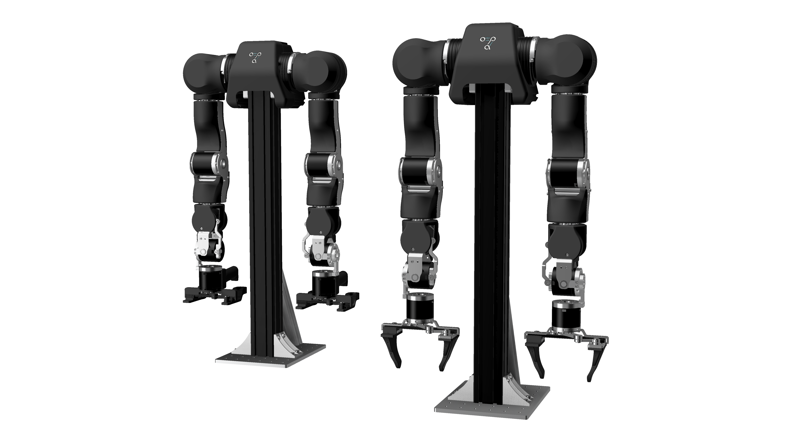
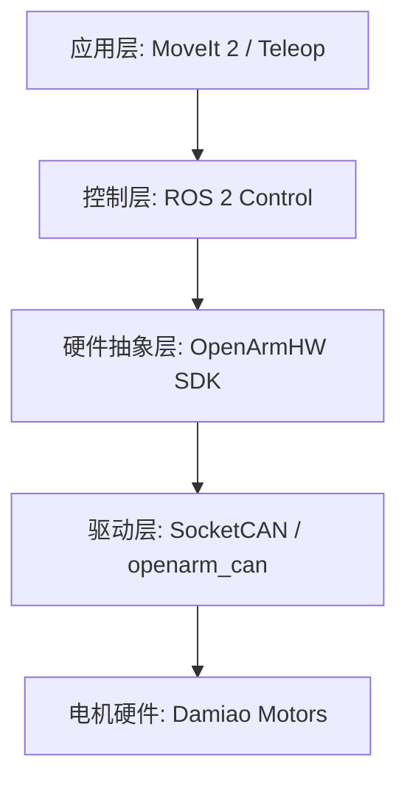

# OpenArm: 开源 7 自由度柔顺人机协作机械臂

OpenArm 是一个高性能、低成本且完全开源的 7 自由度人机协作机械臂，专为 **物理 AI 研究**、**接触密集型任务** 以及 **柔顺控制算法体系** 而设计。



## 🚀 核心特性

- **极致柔顺性**：底层基于大秒（Damiao）电机的 MIT 控制协议，可实现关节维度的刚度与阻尼精确控制。
- **高动态响应**：SocketCAN 驱动架构，闭环控制周期可达 500μs。
- **物理 AI 基因**：高反向驱动（Backdrivability），支持无力传感器条件下的碰撞检测与力反馈遥操作。
- **全生态兼容**：无缝集成 ROS 2 Humble/Jazzy，提供 MoveIt 2 配置与物理仿真接口。

---

这份地图可以帮助您快速定位任何功能的实现细节。如果您对某个特定的算法（如重力补偿的具体公式）或某块硬件的制造参数感兴趣，可以随时提问。

## 🔬 全文件详尽功能手册 (File-by-File Blueprint)

为了让您彻底掌握仓库，我将对每个子模块下的核心文件进行逐一解读：

### 1. openarm_can (底层通讯驱动)
*   **include/openarm/canbus/**:
    *   `can_socket.hpp`: 定义 CAN 套接字封装类，处理 Linux 原生 CAN 数据帧。
    *   `can_device.hpp`: CAN 设备基类，定义了统一的帧回调接口。
    *   `can_device_collection.hpp`: 管理多个 CAN 设备，实现并行收发。
*   **include/openarm/damiao_motor/**:
    *   `dm_motor.hpp`: 定义电机状态数据结构（位置、速度、扭矩等）。
    *   `dm_motor_constants.hpp`: 存储所有电机型号的物理限制参数（转矩上限、速度上限等）。
    *   `dm_motor_control.hpp`: 电机控制命令的生成与解析工具类（Packer/Unpacker）。
    *   `dm_motor_device.hpp`: 继承自 `CANDevice`，实现特定的电机协议逻辑。
    *   `dm_motor_device_collection.hpp`: 提供批量控制电机的接口（如 `enable_all`）。
*   **src/openarm/can/socket/**:
    *   `arm_component.cpp`: 管理机械臂主体 7 个电机的逻辑组合。
    *   `gripper_component.cpp`: 专门处理末端手爪电机的闭合/张开逻辑。
    *   `openarm.cpp`: 模块入口，协调机械臂和手爪的整体通讯。

### 2. openarm_teleop (遥操作与控制算法)
*   **control/** (应用入口):
    *   `gravity_compasation.cpp`: **重力补偿模式**。让手臂处于“零重力”状态，手推即动，用于示教。
    *   `openarm_bilateral_control.cpp`: **双边力反馈控制**。主从手同步，主手能感受到从手的阻力。
    *   `openarm_unilateral_control.cpp`: **单边同步控制**。主手控制从手，但主手无反馈。
*   **src/controller/**:
    *   `control.cpp`: 核心算法实现，包含摩擦力模型、PID 调节以及主从控制逻辑。
    *   `dynamics.cpp`: 动力学求解器，计算 Jacobian 和重力矢量（基于 KDL）。
*   **src/openarm_port/**:
    *   `openarm_init.cpp`: 初始化工具，快速配置所需的 CAN 接口和电机参数。

### 3. openarm_ros2 (ROS 2 集成)
*   **openarm_hardware/**:
    *   `openarm_hardware.cpp`: 关键的硬件接口实现。它作为中间层，将 ROS 2 的控制指令下发给 `openarm_can`。
*   **openarm_bimanual_moveit_config/**:
    *   `config/kinematics.yaml`: 逆运动学求解器参数配置。
    *   `config/joint_limits.yaml`: 安全限制，防止机械臂运动超出物理极限。

### 4. openarm_description (描述文件与资源)
*   **urdf/**:
    *   `v10.urdf.xacro`: 核心描述文件排版架构。
*   **meshes/**:
    *   包含所有零件的 `link0.dae` 等 3D 模型渲染文件。
*   **rviz/**:
    *   `.rviz` 配置文件，一键打开预设好的可视化界面。

### 5. openarm_mujoco (物理仿真)
*   **v1/openarm.xml**: 针对 MuJoCo 的物理参数描述（质量矩阵、地面摩擦、电机特性模型）。

### 6. openarm_hardware (物理硬件工程)
*   **Electrical/**:
    *   `communication.pdf`: 线路连接图。
    *   `J1_J2.pdf`: 各关节电机的接口定义图纸。
*   **STEP / STL/**:
    *   提供完整的机械加工 3D 模型，用于 3D 打印或 CNC 制造。

## 📂 模块指南

| 模块名称 | 路径 | 功能说明 |
| :--- | :--- | :--- |
| **OpenArm CAN** | `src/openarm_can` | **底层通讯驱动**。C++ 实现的 SocketCAN 协议库，包含 Python 绑定。 |
| **OpenArm ROS2** | `src/openarm_ros2` | **系统集成层**。提供 `ros2_control` 硬件接口、带手爪控制的 Bringup 脚本。 |
| **Description** | `src/openarm_description` | **机器人描述**。URDF 模型、Xacro 宏以及高精度 Mesh 文件。 |
| **Hardware** | `src/openarm_hardware` | **硬件工程**。包含 STEP/STL 模型、电路设计等物理资料。 |
| **Teleop** | `src/openarm_teleop` | **遥操作控制**。支持单向/双向力反馈控制应用。 |
| **Mujoco** | `src/openarm_mujoco` | **物理仿真**。各版本的 MuJoCo 仿真环境配置。 |

---

## 🛠️ 快速上手

### 1. 环境准备
确保您的系统运行 Linux（推荐 Ubuntu 22.04+）并安装了 ROS 2 和 `colcon`：
```bash
sudo apt update && sudo apt install ros-<distro>-desktop ros-<distro>-ros2-control
```

### 2. 下载与编译
```bash
git clone https://github.com/xiaokai-jin/OpenArm.git
cd OpenArm
colcon build --symlink-install
```

### 3. 配置 CAN 接口
使用项目自带脚本自动启用 CAN-FD（需具备 SocketCAN 驱动支持）：
```bash
sudo ./src/openarm_can/setup/configure_socketcan.sh can0 -fd
```

### 4. 启动可视化控制
```bash
source install/setup.bash
ros2 launch openarm_bringup openarm.launch.py can_interface:=can0
```

---

## 🧠 分层架构图


```mermaid
graph TD
    A[应用层: MoveIt 2 / Teleop] --> B[控制层: ROS 2 Control]
    B --> C[硬件抽象层: OpenArmHW SDK]
    C --> D[驱动层: SocketCAN / openarm_can]
    D --> E[电机硬件: Damiao Motors]
```

---

## 📈 未来演进方向

- [ ] **笛卡尔空间阻抗控制**：提升末端执行器维度的力交互性能。
- [ ] **全臂碰撞检测**：无需力传感器的动力学观测器方案。
- [ ] **视觉大语言模型 (VLM) 集成**：赋能机械臂在非结构化场景下的策略决策。
- [ ] **自主零点校准**：基于物理特性的零位自动化对齐。

---

## 🤝 贡献与协作

1. **GitHub 版本回退**：项目已初始化并托管至 GitHub，可随时利用 `git reset --hard` 回退至安全版本。
2. **提交代码**：请确保代码符合 Google C++ 编程规范。
3. **中文注释**：核心驱动代码（src/openarm_can）已全面汉化，方便中文社区开发者快速研究。

## 📄 开源协议
本项目遵循 [Apache 2.0 协议](LICENSE)。

---
**探索物理 AI 的未来，从 OpenArm 开始。**

---

## ✅ 新增：MoveIt 重力补偿前馈流程（双臂）

当前仓库已完成双臂重力补偿前馈接入 ROS2 控制链路，核心逻辑如下：

1. MoveIt 负责轨迹规划与执行（主控制）
2. stiffness/damping 控制器提供 kp/kd（主导）
3. 重力补偿节点基于 URDF + KDL 实时计算 tau_g(q)
4. 通过左右臂 effort 前馈控制器下发 tau_ff（辅助）

推荐启动命令：

```bash
source /opt/ros/humble/setup.bash
cd ~/OpenArm
source install/setup.bash
ros2 launch openarm_bimanual_moveit_config demo.launch.py use_gravity_compensation:=true
```

快速检查：

```bash
ros2 node list | grep gravity_compensation_node
ros2 topic hz /left_gravity_compensation_controller/commands
ros2 topic hz /right_gravity_compensation_controller/commands
```
